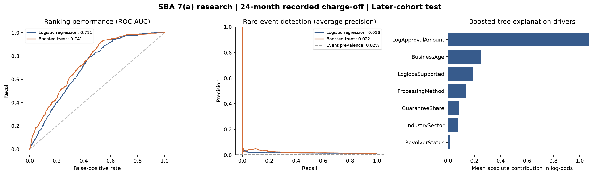

# US credit-data research and first experiment

Research prototype only. This analysis does not approve or reject applications and does not establish regulatory compliance.

## Dataset selection

| Dataset | Recent availability | Useful for | Access / limitation |
|---|---|---|---|
| [SBA 7(a)/504](https://data.sba.gov/dataset/7a-504-foia) | June 30, 2026 snapshot | Small-business recorded charge-offs | Public download; approved loans, limited underwriting features |
| [HMDA](https://www.consumerfinance.gov/about-us/newsroom/2025-hmda-data-on-mortgage-lending-now-available/) | 2025 data released March 31, 2026 | Application decisions and fair-lending research | Public; does not supply subsequent default labels |
| [Freddie Mac](https://www.freddiemac.com/research/datasets/sf-loanlevel-dataset) | Performance through March 31, 2026 | Mortgage delinquency and loss modeling | Registration and terms apply |
| [Fannie Mae](https://capitalmarkets.fanniemae.com/credit-risk-transfer/single-family-credit-risk-transfer/fannie-mae-single-family-loan-performance-data) | July 31, 2026 release; Q1 2026 performance | Mortgage performance modeling | Registration; commercial use restrictions |

The release date is distinct from origination date. This uses a recent snapshot but deliberately older training loans so their outcomes mature before testing on newer originations.

## Experiment design

- Source: 388,338 SBA 7(a) records; snapshot 2026-06-30.
- Training: 64,697 funded loans approved 2019-10-01 through 2021-06-30; 138 events (0.213%).
- Test: 57,086 funded loans approved 2023-07-01 through 2024-06-30; 467 events (0.818%).
- Target: a recorded SBA charge-off within 24 calendar months after approval. This is not lifetime default probability, delinquency probability or loss given default.
- Training outcome windows end before the first test approval. All test outcome windows end by the snapshot date. No hyperparameter selection or calibration uses test outcomes.
- Fixed model settings; no oversampling or class weighting. Missing numeric values are imputed from training data; categorical encoding is fitted on training data only.
- Removed 420 test loans with matching borrower name, street and ZIP in training. Matching is approximate; it cannot guarantee entity independence.
- Cancelled, undisbursed, missing-disbursement and contradictory-date records are excluded. EXEMPT is not treated as proof of good standing; it means no disclosed terminal status under the dictionary.
- Loans paid off early count as no charge-off by the horizon. Thus the endpoint includes prepayment as a competing outcome.
- Features: log approved amount, guarantee share, log reported jobs, business age, business type, industry sector, revolving indicator and SBA processing method.
- Names, addresses, ZIPs, state, lender identifiers, interest rates, loan term, loan status, charge-off amounts/dates, payoff dates and secondary-market sale indicators are excluded from predictors. Disbursement is an eligibility filter only.
- Approved terms are negotiated lending outcomes. This is risk conditional on an approved loan package, not an applicant-only pre-approval model.

## Results

| Model | ROC-AUC (95% bootstrap interval) | Average precision | Brier score | Mean predicted risk | Top 10% recall |
|---|---:|---:|---:|---:|---:|
| Logistic regression | 0.711 (0.691-0.728) | 0.0160 | 0.00813 | 0.252% | 20.3% |
| Boosted trees | 0.741 (0.723-0.759) | 0.0218 | 0.00810 | 0.270% | 27.8% |

Test event prevalence / random-ranking average-precision reference: **0.818%**. The training-prevalence constant model has Brier score **0.00815**.
Calibration warning: boosted trees predict an average risk of 0.270%, versus the observed 0.818%. Training prevalence was 0.213%. Ranking performance does not fix this underestimation. A later calibration cohort and a fresh untouched evaluation are needed before decision use.
Higher ROC-AUC and average precision are better; lower Brier score is better. AUC is ranking, not percentage accuracy. Top-decile recall is an exploratory fixed review-budget diagnostic, not an approval threshold.
Paired bootstrap 95% interval for boosted-tree minus logistic ROC-AUC: [0.017613221976595674, 0.04288981130289631]. Intervals use 200 loan-level resamples and do not account for lender dependence or future economic uncertainty.

## Explanations

Tree path-dependent Shapley contributions were computed on a seeded sample of 4,000 test loans. Contributions add to the raw model margin with maximum absolute error 8.58307e-06. One-hot contributions are grouped by original feature before taking mean absolute values.
Largest explanation drivers: LogApprovalAmount, BusinessAge, LogJobsSupported, ProcessingMethod, GuaranteeShare.
These are model explanations relative to its tree-path background, not causal effects, validated customer notices or proof of permissible feature use. Correlated features and product selection can alter attribution.

## Loan-term sensitivity and suspected leakage

An initial diagnostic run including TermInMonths produced boosted-tree ROC-AUC 0.910 and logistic ROC-AUC 0.735. Loan term dominated the tree explanations. Many early charge-off cases have unusual terms around 100-113 months rather than the common 120 months. The current data dictionary describes term only as length of loan term; it does not establish that this is an immutable origination value.
TermInMonths is therefore excluded from the final experiment. Its initial results are preserved in term_included_diagnostic.json as a warning, not a validated performance claim. The data pattern suggests possible post-origination changes but does not prove their cause. Historical field lineage must be verified with SBA or point-in-time source records.
This exclusion was prompted by inspecting test-set explanations, so the final test is now a development holdout rather than a pristine final evaluation. A new untouched cohort is required before reporting externally validated performance.

## What the experiment cannot establish

- The approved/funded-only population does not represent rejected applicants. No reject inference is attempted.
- Charge-off is delayed and narrower than default; hidden EXEMPT statuses may include delinquency. Absence of a recorded charge-off is not proof of repayment ability.
- The current snapshot is a retrospective reconstruction, not historical point-in-time snapshots. Corrections or updated attributes can introduce remaining look-ahead risk.
- Training and test span different economic regimes, including pandemic assistance. Calibration can shift materially; no deployment probability is certified.
- The file lacks verified income, detailed cash flow, debt-service coverage, credit-bureau history and protected-class labels needed for the intended broader validation. State diagnostics are not a fair-lending audit.
- Excluding direct demographic/geographic fields does not remove proxy discrimination. No fair-lending clearance, state-law rules, adverse-action validation or legal review has been completed.
- Feature availability at the intended decision point must be verified with a lender before use. Approval amount and guarantee terms describe the existing loan package.
- Fresh 2025-2026 loans are not labeled negative merely because they have had less than 24 months to develop a charge-off.

## Next build stage

Use this as a reproducible small-business research baseline. For a mortgage system, obtain the registered Freddie Mac/Fannie Mae performance data and separately use HMDA for application/fair-lending research; do not assume public files can be reliably joined borrower by borrower. Choose the lender type and states before implementing the regulatory rule layer.

## Reproducibility

Source file: https://data.sba.gov/sites/default/files/uploaded_resources/FOIA_7a_FY2020_Present_asof_260630.csv
SHA-256: `6c1e9132b5141a19f82bdc8ccafb86c9a01662461cad41ddb36a3cf409d8a4fe`
Software versions: {"python": "3.12.14", "pandas": "3.0.1", "numpy": "2.5.3", "sklearn": "1.9.1", "xgboost": "3.4.1"}
Run `run_experiment.py` with the project dependencies in `packages`. The downloaded raw source and dictionary remain in `data`; results and research model bundles are in `results`. Bundles are local research artifacts; only load trusted joblib files.
